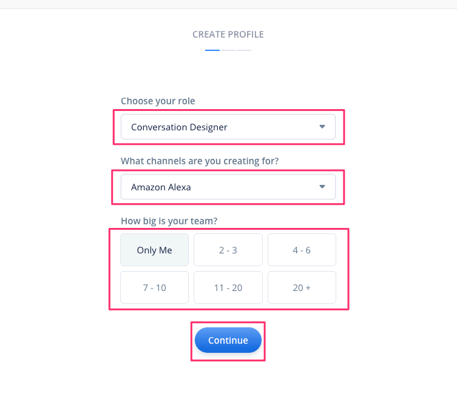

## Voiceflowアカウントの作成

https://voiceflow.com/ にアクセスし、画面中央の"Get Started for Free"か、右上の"Sign up"のどちらかをクリックします。

アカウントの新規登録画面が表示されます。

登録する方法は以下の３つがあります。

1. メールアドレスを使う
2. Googleアカウントを使う
3. Facebookアカウントを使う

- メールアドレスで登録する場合は、名前・メールアドレス・パスワードを入力して、"Create Account"をクリックします。

- Googleアカウント・Facebookアカウントで登録する場合は、それぞれのボタンをクリックすると、ログイン画面が表示されますので、お使いのGoogle/Facebookアカウントでログインします。その際に権限の許可を求める画面が表示された場合は許可するようにしてください。

”Welcome to Voiceflow”が表示されればアカウント作成が完了しました。"Get Started"をクリックします。

## 初期設定

最初にかんたんな初期設定がありますので、順に答えていきましょう。**どれを選択したとしてもVoiceflowの利用に基本的に影響はありませんので安心してください。**

最初にプロフィールの設定です。Voiceflowをどういうふうに使うのかを聞いてくるので、適当に選んでください。選んだら、"Continue"をクリックします。

- "Choose your role"
  - あなたの立場です。開発者やデザイナーなどから選んでください。
- "What Channels are you connecting for?"
  - Voiceflowで作りたいプラットフォームです。AlexaやGoogleなどから選んでください。
- "How big is your team?"
  - チームメンバーの数を入力します。個人であれば"Only Me"でよいでしょう。

次にワークスペースの名前です。あとから変更もできますのでなんでもよいです。入力したら、"Continue"をクリックします。

コラボレーション機能を使って共同でスキルを作ることもできます。ここで一緒にスキル開発を行いたい人のメールアドレスを入力すると招待されます。あとから追加もできますので、"Skip for now"をクリックします。

以下のような画面が表示されれば初期設定は完了しています。初期設定完了後に画面のメニューの説明が表示されます。右上の"☓"で閉じます。

アカウント作成直後は"My First Project" という予め用意されているデモプロジェクトが開いた状態になっています。左上の"＜"をクリックします。

プロジェクトの一覧画面が表示されます。Voiceflowでは、Alexaスキルを「プロジェクト」という単位で管理します。このチュートリアルシリーズでは、この一覧画面でプロジェクトの新規作成から行いますので、"My First Project"は使用しません。

削除する場合は、プロジェクトのアイコンをクリックして"Remove Project"をクリックしてください。

:::message
削除したプロジェクトは復旧できませんので、ご注意ください。
:::

これで準備が整いました。ではチュートリアルをお楽しみに！
